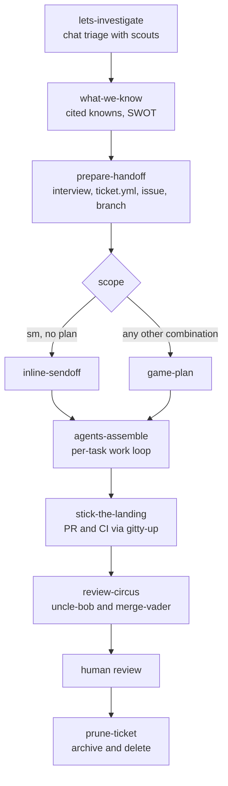

# rygentic-harness

A Claude Code plugin marketplace for all of my skills. The repository runs on an "everything is
a plugin" mindset, inspired by the idea behind the DeepSeek harness: the repo root owns only the
marketplace manifest and the shared quality gate, and every capability ships as a plugin under
`plugins/`, one directory per plugin carrying its own manifest, skills, and agents. The
marketplace manifest lists one entry per plugin, and the test suite enforces that the entries
and the directories stay in step.

## Install

```text
/plugin marketplace add <owner>/rygentic-harness
/plugin install <plugin>@rygentic-harness
```

The marketplace add step reads this repo's `.claude-plugin/marketplace.json`; the install step
names any plugin it lists. [docs/claude-code.md](docs/claude-code.md) covers model ids, agent
discovery, and validation.

## Plugins

| Plugin       | What it does                                                                |
| ------------ | --------------------------------------------------------------------------- |
| mightymodels | Ticket-scoped agent dev loop: per-ticket state, model routing, review stack |

### mightymodels

A ticket-scoped development loop for coding agents. One unit of work gets one
`.mightymodels/<slug>/` directory and one `ticket.yml` carrying its scope and model routing. The
lifecycle ends with `/prune-ticket` compressing the whole directory into a 30-line archive. The
unit of deletion is the unit of work, so working state never outlives the ticket that produced
it. The skills are standard `SKILL.md` directories and the seven workers are Claude Code
subagent files, all under `plugins/mightymodels/`.



Each stage has one job, writes one artifact, and reads `ticket.yml` before doing anything else.
Contracts shared by every stage live with the skills that own them: the severity table, verdict
vocabularies, and the two-half brief schema are in
`plugins/mightymodels/skills/agents-assemble/references/contracts.md`; the ticket schema and
directory layout are in `plugins/mightymodels/skills/prepare-handoff/references/`. When a skill
and a contract disagree, the contract wins and the skill gets fixed.

## Layout

```text
plugins/         one directory per plugin; each carries its own manifest, skills, and agents
  mightymodels/  the dev loop: twenty skills, seven worker agents
evals/           pydantic-evals harness: package source, per-skill datasets, dated results
tests/           marketplace-wide contracts: plugin layout, manifest agreement, integrity
docs/            human documentation for the harness and the mightymodels plugin
scripts/         quality gate, security scan over every plugin, git hooks
.claude-plugin/  the rygentic-harness marketplace manifest
```

## Adding a plugin

A new plugin is a directory under `plugins/` with a `.claude-plugin/plugin.json` naming it,
plus its `skills/` and `agents/`. Add a matching entry to the marketplace manifest and the rest
is automatic: `tests/test_plugin.py` checks the entry against the directory and holds every
plugin's skills and agents to the frontmatter contracts, and `scripts/security.sh` scans the
new skill and agent text for injection indicators without any configuration.
[CONTRIBUTING.md](CONTRIBUTING.md) has the details.

## Documentation

| Page                                       | What it covers                                  |
| ------------------------------------------ | ----------------------------------------------- |
| [docs/workflow.md](docs/workflow.md)       | The full loop, stage by stage, with diagrams    |
| [docs/skills.md](docs/skills.md)           | Every skill: what it does and when it fires     |
| [docs/agents.md](docs/agents.md)           | The seven workers and how models get routed     |
| [docs/state.md](docs/state.md)             | The `.mightymodels/` directory and `ticket.yml` |
| [docs/claude-code.md](docs/claude-code.md) | Running under Claude Code                       |
| [evals/README.md](evals/README.md)         | The eval harness and how results are read       |

## Evals

The eval harness currently covers the mightymodels plugin: every one of its measured skills
shipped with a baseline delta, and edits re-run the harness before they land. Replaying the
iteration-1 sessions grades 65 of 65 assertions with the skills on, against 31 of 65 without
them. `evals/README.md` covers the harness; [CONTRIBUTING.md](CONTRIBUTING.md) covers the gate
a change has to pass, and `make ci` runs the whole thing: ruff, ty, shellcheck, markdownlint,
the prompt-injection scan over every plugin, and the test suite on Python 3.14.

## Status

mightymodels is at 0.6.0 and is the marketplace's first plugin. Its hook layer (session
covenant injection, verification gates at Stop, PreCompact ticket snapshots) and the
team/personal overlay split are designed but not yet shipped. CHANGELOG.md has the full trail.

See [CONTRIBUTING.md](CONTRIBUTING.md) before opening a PR, and
[SECURITY.md](SECURITY.md) for reporting anything sensitive.
