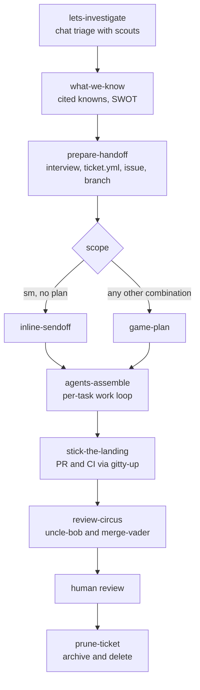

# mightymodels

A ticket-scoped development loop for coding agents. One unit of work gets one
`.mightymodels/<slug>/` directory and one `ticket.yml` carrying its scope and model routing. The
lifecycle ends with `/prune-ticket` compressing the whole directory into a 30-line archive. The
unit of deletion is the unit of work, so working state never outlives the ticket that produced
it.

mightymodels is a Claude Code plugin: the skills are standard `SKILL.md` directories, the seven
workers are Claude Code subagent files, and the manifests under `.claude-plugin/` are what the
plugin loader reads. [docs/claude-code.md](docs/claude-code.md) covers the harness specifics.

## The loop at a glance



Each stage has one job, writes one artifact, and reads `ticket.yml` before doing anything else.
[docs/workflow.md](docs/workflow.md) walks through every stage, the sprint-loop sequence, and
the ticket lifecycle.

## Install

```text
/plugin marketplace add <owner>/mightymodels
/plugin install mightymodels@rygentic-harness
```

The marketplace add step reads this repo's `.claude-plugin/marketplace.json` (the marketplace is
named rygentic-harness; mightymodels is one of its plugins). Model ids, agent discovery, and
validation are in [docs/claude-code.md](docs/claude-code.md).

## Layout

```text
skills/          twenty skills: the loop stages, the review stack, the fleet reference, utilities
agents/          scout, engineer, budgetron, gitty-up, grumpy, sunny, wingman (one .md each)
evals/           pydantic-evals harness: package source, per-skill datasets, dated results
tests/           the harness test suite, including the plugin portability contract
docs/            human documentation
scripts/         quality gate, security scan, git hooks
.claude-plugin/  plugin and marketplace manifests
```

Contracts shared by every stage live with the skills that own them. The severity table, verdict
vocabularies, and the two-half brief schema are in
`skills/agents-assemble/references/contracts.md`; the ticket schema and directory layout are in
`skills/prepare-handoff/references/`. When a skill and a contract disagree, the contract wins
and the skill gets fixed.

## Documentation

| Page                                       | What it covers                                  |
| ------------------------------------------ | ----------------------------------------------- |
| [docs/workflow.md](docs/workflow.md)       | The full loop, stage by stage, with diagrams    |
| [docs/skills.md](docs/skills.md)           | Every skill: what it does and when it fires     |
| [docs/agents.md](docs/agents.md)           | The seven workers and how models get routed     |
| [docs/state.md](docs/state.md)             | The `.mightymodels/` directory and `ticket.yml` |
| [docs/claude-code.md](docs/claude-code.md) | Running under Claude Code                       |
| [evals/README.md](evals/README.md)         | The eval harness and how results are read       |

## Evals

Every skill shipped with a measured baseline delta, and edits re-run the harness before they
land. Replaying the iteration-1 sessions grades 65 of 65 assertions with the skills on, against
31 of 65 without them. `evals/README.md` covers the harness; [CONTRIBUTING.md](CONTRIBUTING.md)
covers the gate a change has to pass, and `make ci` runs the whole thing: ruff, ty, shellcheck,
markdownlint, the skills prompt-injection scan, and the test suite on Python 3.14.

## Status

0.6.0. The hook layer (session covenant injection, verification gates at Stop, PreCompact
ticket snapshots) and the team/personal overlay split are designed but not yet shipped.
CHANGELOG.md has the full trail.

See [CONTRIBUTING.md](CONTRIBUTING.md) before opening a PR, and
[SECURITY.md](SECURITY.md) for reporting anything sensitive.
