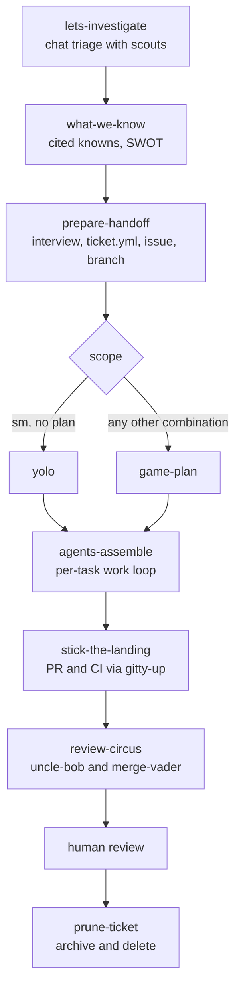

# rygentic-harness

A Claude Code plugin marketplace for all of my skills. The repository runs on an "everything is
a plugin" mindset, inspired by the idea behind the DeepSeek harness: the repo root owns only the
marketplace manifest and the shared quality gate, and every capability ships as a plugin under
`plugins/`, one directory per plugin carrying its own manifest, skills, and agents. The
marketplace manifest lists one entry per plugin, and `make check` validates the manifests with
`claude plugin validate --strict`.

## Install

```text
/plugin marketplace add <owner>/rygentic-harness
/plugin install <plugin>@rygentic-harness
```

The marketplace add step reads this repo's `.claude-plugin/marketplace.json`; the install step
names any plugin it lists. [docs/claude-code.md](docs/claude-code.md) covers model ids, agent
discovery, and validation.

## Plugins

| Plugin | What it does |
| ------------ | --------------------------------------------------------------------------- |
| mightymodels | Ticket-scoped agent dev loop: per-ticket state, model routing, review stack |
| vibe-code | Skills for building, hardening and tuning Claude Code agents, skills, and loops |
| python-harness | Python review skill, read-only fact agent, toolchain hooks, CLI, MCP server |

### mightymodels

A ticket-scoped development loop for coding agents. One unit of work gets one
`.mightymodels/<slug>/` directory and one `ticket.yml` carrying its scope and model routing. The
lifecycle ends with `/prune-ticket` compressing the whole directory into a 30-line archive. The
unit of deletion is the unit of work, so working state never outlives the ticket that produced
it. The skills are standard `SKILL.md` directories and the seven workers are Claude Code
subagent files, all under `plugins/mightymodels/`.


```mermaid
flowchart TD
    A["lets-investigate\nchat triage with scouts"] --> B["what-we-know\ncited knowns, SWOT"]
    B --> C["prepare-handoff\ninterview, ticket.yml, issue, branch"]
    C --> D{scope}
    D -->|"sm, no plan"| E["yolo"]
    D -->|"any other combination"| F["game-plan"]
    E --> G["agents-assemble\nper-task work loop"]
    F --> G
    G --> H["stick-the-landing\nPR and CI via gitty-up"]
    H --> I["review-circus\nuncle-bob and merge-vader"]
    I --> J["human review"]
    J --> K["prune-ticket\narchive and delete"]
```

Each stage has one job, writes one artifact, and reads `ticket.yml` before doing anything else.
Contracts shared by every stage live with the skills that own them: the severity table, verdict
vocabularies, and the two-half brief schema are in
`plugins/mightymodels/skills/agents-assemble/references/contracts.md`; the ticket schema and
directory layout are in `plugins/mightymodels/skills/prepare-handoff/references/`. When a skill
and a contract disagree, the contract wins and the skill gets fixed.

### vibe-code

Eleven skills for building, hardening and tuning the agents, skills, hooks, and loops that other
plugins are made of, plus a `vibe-code` CLI that the skills call to validate what they write. The plugin
ships no agents. It was called `ai-engineer` before 0.3.0; an install under the old name has to be
removed and reinstalled as `vibe-code`.

| Skill | What it does |
| ------------------- | ------------------------------------------------------------------------ |
| `build-a-loop` | Designs an agent loop, its stop condition, and a `LOOP.md` contract |
| `create-agents-md` | Generates an AGENTS.md from the repository, with an optional CLAUDE.md |
| `create-hooks` | Builds repo-specific Claude Code hooks as Python scripts and tests them |
| `create-instructions` | Writes `.claude/rules/` files and checks that Claude Code loads them |
| `create-mcp` | Interviews you, then scaffolds a Python MCP server and its Claude config |
| `create-skill` | Writes a skill from scenarios, with eval cases recorded before the skill |
| `create-subagent` | Builds a subagent file and validates it |
| `humanizer` | Removes signs of AI-generated writing from prose |
| `plan-plugin` | Interviews you and writes a phased plugin plan and an empty plugin shell |
| `promptlint` | Reviews and improves a coding-agent prompt for Claude Code |
| `tune-skill-descriptions` | Tunes skill descriptions against real Claude Code routing on a trigger set |

The CLI needs [uv](https://docs.astral.sh/uv/) on your `PATH` and a Claude Code whose
`claude plugin validate` accepts `--json`. The plugin's `bin/vibe-code` launcher starts the CLI
through `uv tool run`, with the dependency versions pinned on its first line. The pins select
versions and do not verify hashes. The skills are standard `SKILL.md` directories under
`plugins/vibe-code/skills/`. [plugins/vibe-code/README.md](plugins/vibe-code/README.md) covers
install, the CLI, the launcher and Windows.

### python-harness

A review skill, a fact-gathering agent, two hooks, a CLI and an MCP server for Python projects.
`/python-harness:what-would-ryan-say` reviews a PR, a branch or a codebase and writes
`PYTHON-REVIEW.md` or `REFACTOR-PLAN.md`. It never edits code and runs only when you type it. It
dispatches the read-only `pylens` agent, which returns cited facts. The SessionStart hook briefs
each session on the project's Python toolchain, and the PreToolUse hook adds a note when a Bash
command runs plain `python` instead of `uv run python`. Neither blocks a command.

The `python-harness` CLI has two commands, `inspect survey` and `inspect gate`. The MCP server,
also named `python-harness`, has six tools. `search_python_docs` and `read_python_docs` read
standard-library documentation from `docs.python.org`. `collect_python_facts`, `map_python_calls`,
`check_citations` and `plan_review_surface` read the project Claude Code was started in.

The plugin needs [uv](https://docs.astral.sh/uv/) on your `PATH` and a POSIX system (Linux, macOS
or WSL). The CLI launcher and the server both start through `uv tool run` with the dependency
versions pinned. The pins select versions and do not verify hashes. The hooks and the server have
not yet been run inside a live Claude Code session.
[plugins/python-harness/README.md](plugins/python-harness/README.md) covers install, the hooks,
the server, the launcher and the known limitations.

## Layout

```text
plugins/         one directory per plugin; each carries its own manifest and skills
  mightymodels/  the dev loop: twenty skills, seven worker agents
  vibe-code/     authoring skills and the `vibe-code` CLI: eleven skills, no agents,
                 with its own tests and eval cases
  python-harness/ Python review: one skill, one agent, hooks, the `python-harness` CLI
                 and an MCP server, with its own tests
docs/            human documentation for the harness and the mightymodels plugin
scripts/         the quality gate (`quality.sh`), checkout setup, and a log helper
.claude-plugin/  the rygentic-harness marketplace manifest
```

## Adding a plugin

A new plugin is a directory under `plugins/` with a `.claude-plugin/plugin.json` naming it,
plus its `skills/` and `agents/`. Add a matching entry to the marketplace manifest and the rest
is automatic: `scripts/quality.sh` runs `claude plugin validate --strict` for every directory under
`plugins/` and for the marketplace root, which checks the manifests and the skill and agent
frontmatter. [CONTRIBUTING.md](CONTRIBUTING.md) has the details.

## Documentation

| Page | What it covers |
| ------------------------------------------ | ----------------------------------------------- |
| [docs/workflow.md](docs/workflow.md) | The full loop, stage by stage, with diagrams |
| [docs/skills.md](docs/skills.md) | Every skill: what it does and when it fires |
| [docs/agents.md](docs/agents.md) | The seven workers and how models get routed |
| [docs/state.md](docs/state.md) | The `.mightymodels/` directory and `ticket.yml` |
| [docs/claude-code.md](docs/claude-code.md) | Running under Claude Code |
| [plugins/vibe-code/README.md](plugins/vibe-code/README.md) | The vibe-code plugin: install, skills, CLI, launcher |
| [plugins/python-harness/README.md](plugins/python-harness/README.md) | The python-harness plugin: install, hooks, server, launcher, limitations |

## Evals

Some mightymodels skills keep dated eval results in `plugins/mightymodels/skills/<skill>/evals/`.
The vibe-code eval cases live in `plugins/vibe-code/evals` and run with `claude plugin eval`,
which costs money and is not part of the gate. [CONTRIBUTING.md](CONTRIBUTING.md) covers the gate
a change has to pass: `make check`, which syncs the locked environment, runs pre-commit, and runs
`scripts/quality.sh`.

## Status

vibe-code is at 0.4.0. python-harness is at 0.1.0. mightymodels is at 0.8.0 and is the
marketplace's first plugin. Its hook layer (session covenant injection, verification gates at
Stop, PreCompact ticket snapshots) and the team/personal overlay split are designed but not yet
shipped. CHANGELOG.md has the full trail.

See [CONTRIBUTING.md](CONTRIBUTING.md) before opening a PR, and
[SECURITY.md](SECURITY.md) for reporting anything sensitive.
