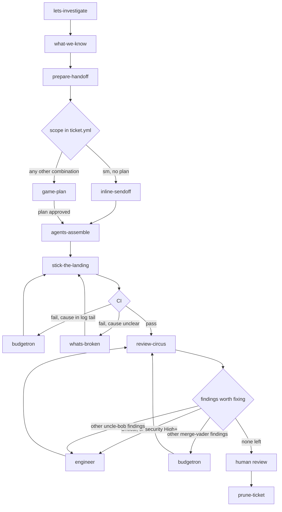
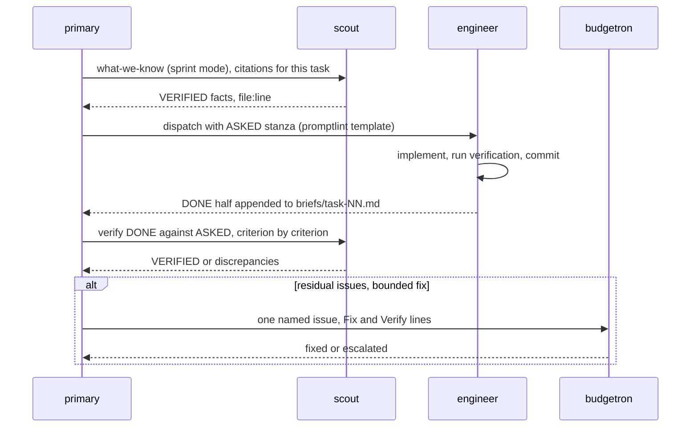
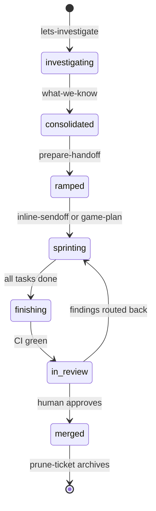

# The workflow

mightymodels splits one unit of work across several short sessions, each with a narrow job and a
written artifact. The primary agent in every session delegates aggressively: scouts do the
reading, engineers do the writing, and the primary spends its context on routing and judgment.
State lives in `.mightymodels/<slug>/`, not in anyone's conversation history, so a session can die
or compact without losing the ticket.

The diagram below is the whole loop, including the two repair cycles that make it honest: CI
failures route back to a fixer, and review findings route back by their source.

## Investigate

Work starts in chat, before any ticket exists. `lets-investigate` runs a triage conversation:
the primary states the problem plainly, dispatches scouts one narrow question at a time, and
accumulates cited facts in the conversation. Scouts retrieve; they do not diagnose. When the
fact base feels sufficient, the session ends by offering `what-we-know`.

`what-we-know` consolidates: a table of knowns with file:line citations, an enumerated list of
uncertainties, each uncertainty resolved through the ask-user dialog, and a SWOT-level read of
the options. This is the moment the human steers. The same skill also runs in a stripped-down
sprint mode later, where it gathers citations for a single task and asks nothing.

## Hand off

`prepare-handoff` turns understanding into a startable unit of work. It asks five questions:
what to call the ticket, whether to open a GitHub issue, whether to cut a branch, whether a
compaction is likely, and how big the per-task scope is. From the answers it creates
`.mightymodels/<slug>/` with `ticket.yml` (scope, routing, companion docs), optionally files the
issue using the repo's own template with humanizer-cleaned prose, cuts and pushes the branch,
and writes a thin `handoffs/SPRINT.md` so the next session can bootstrap by reading two files.
Model routing is derived here: large scope pulls the engineer up a tier, an expected compaction
sets `plan-first: true`.

## Ramp

The next session starts fresh and cheap. Which ramp it takes is not a judgment call; it is read
from `ticket.yml`. This table is the canonical statement of the routing rule; every other
document points here rather than restating it:

| scope | plan-first | ramp             |
| ----- | ---------- | ---------------- |
| sm    | false      | `inline-sendoff` |
| sm    | true       | `game-plan`      |
| med   | false      | `game-plan`      |
| med   | true       | `game-plan`      |
| large | false      | `game-plan`      |
| large | true       | `game-plan`      |

`inline-sendoff`: reconfirm the ticket's
claims at HEAD with two or three scouts, write the task checklist into the issue body, and hand
straight to `agents-assemble`. `game-plan`: verify claims,
then write `plan.md` as high-level strategy with enumerated tasks and size hints, deliberately
free of code citations because citations go stale while the plan survives compaction. The user
approves the plan before any dispatch.

## Sprint

`agents-assemble` runs the per-task loop. One iteration looks like this:

The ASKED half is written by the primary at dispatch: objective, checkable acceptance criteria,
verification commands, the files the task owns, and the engineer tier from `ticket.yml`. The
engineer appends the DONE half when it finishes. The whole brief is capped at 80 lines, roughly
15 ASKED and up to 65 DONE, and the verifying scout checks the halves against each other rather
than trusting either. Residuals with a known, bounded fix go to `budgetron`, the
budgeted cheap path. Repeated failures on the same ground invoke `whats-broken`, a phased
debugging protocol with a three-strike breaker that escalates to the human instead of attempting
a fourth patch.

The loop advances only after its evidence is externalized: the engineer appends the DONE half
(with the commit hash) to the brief before reporting, the verification outcome is recorded
before a task's box is checked, and recovery reads the brief, never anyone's conversation. The
full ordering rule lives in `skills/agents-assemble/references/contracts.md`.

The sprint ends with a `REPORT.md` of at most 50 lines: what shipped, what deviated, what
remains.

## Finish

`stick-the-landing` pushes the branch and dispatches `gitty-up` to open the PR from the repo's
template and watch CI. Failures are routed by the log-tail test: if the fix is obvious from the
last screen of the log, it is a `budgetron` dispatch; if the cause needs actual
investigation, it is `whats-broken`. On green, the skill offers to write `handoffs/REVIEW.md` so
the review session can bootstrap thin.

## Review

`review-circus` is the endgame session, usually on a cheap primary. Scouts triage the review
surface, then `uncle-bob` and `merge-vader` run in parallel on the models pinned in
`ticket.yml`, writing reports under `.mightymodels/<slug>/review/`. Findings are deduped and
severity-unified through the shared table in `contracts.md`, and an abridged, human-readable
comment is always posted to the PR, pass or fail, so the review trail is documented where
reviewers live.

Remediation routes by risk first, then by source. A Critical finding, or a security finding at
High severity or above, goes to a full engineer no matter which reviewer surfaced it: a
severity that says "harm now" outranks any statement about who found the defect. Below that
line, source decides: uncle-bob findings concern structure and abstraction, so they go
to a full engineer; merge-vader findings tend to be concrete and bounded, so they go to
`budgetron`, whose own contract escalates anything that turns out bigger than named.
Pre-existing debt is triaged separately from regressions: the loop fixes what the branch broke
and files the rest instead of scope-creeping the ticket.

## Prune

After human review and merge, `/prune-ticket` closes the ticket: it compresses the directory
into an archive of at most 30 lines (what shipped, PR link, decisions, gotchas), proposes any
cascading documentation updates as diffs for approval, and deletes the ticket directory. It
refuses while live work remains, such as an active `whats-broken.md` or unpushed commits.

## Ticket lifecycle

## Where the rules live

Prose in this directory explains; the contracts define. The severity table, verdict vocabularies
(scout, engineer, budgetron, gitty-up, grumpy, sunny, wingman, review), and the two-half brief
schema are in
`skills/agents-assemble/references/contracts.md`. The `ticket.yml` schema with its derivation rules
is in `skills/prepare-handoff/references/ticket-schema.md`, and the directory layout with its
writer/reader matrix is in `skills/prepare-handoff/references/mightymodels-dir.md`. When this page
and a contract disagree, the contract wins.
